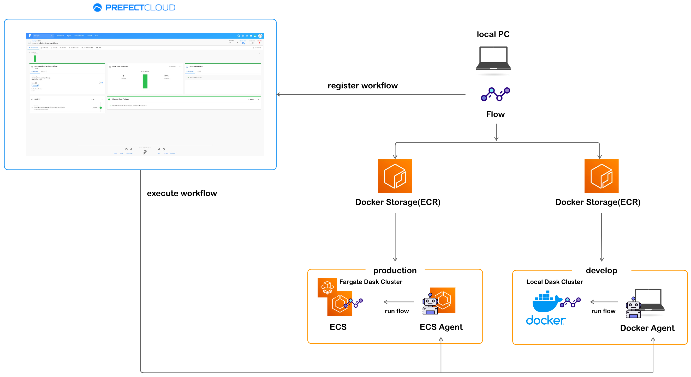
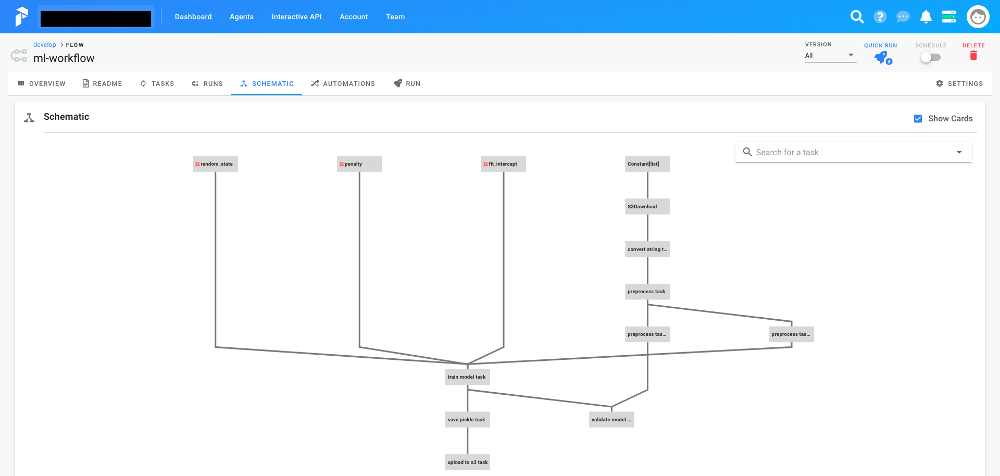
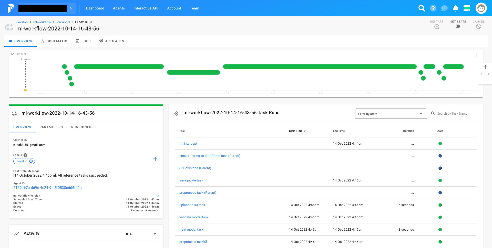

# prefect-ml-workflow
Example of how to build ml training workflow on AWS by Prefect  
Blog(Japanese): [TODO] Add blog url


## Architecture


|  | Production | Develop |
| :---: | :---: | :---: |
| Agent | ECS Agent | Docker Agent |
| Storage | Docker Storage | Docker Storage |
| Executor | DaskExecutor | LocalDaskExecutor |
| Schedule | every 1 hour | - |
| Notification | Slack | - |

  
## Workflow Detail
Following simple ML model training pipeline is implemented.
   

Extract Raw Data -> Preprocess Data -> Train Model -> Validate Model -> Upload Trained Model

- Data: [avazu-ctr-prediction dataset](https://www.kaggle.com/c/avazu-ctr-prediction/)
- Preprocess: [Feature Hashing](https://scikit-learn.org/stable/modules/generated/sklearn.feature_extraction.FeatureHasher.html)
- Model: [SGDClassifier](https://scikit-learn.org/stable/modules/generated/sklearn.linear_model.SGDClassifier.html)

## Setup for Agent
### Docker Agent
Run Docker Agent in local environment.  
```bash
$ prefect agent docker start --label develop

[2022-10-12 10:24:09,492] INFO - agent | Registering agent...
[2022-10-12 10:24:09,736] INFO - agent | Registration successful!

 ____            __           _        _                    _
|  _ \ _ __ ___ / _| ___  ___| |_     / \   __ _  ___ _ __ | |_
| |_) | '__/ _ \ |_ / _ \/ __| __|   / _ \ / _` |/ _ \ '_ \| __|
|  __/| | |  __/  _|  __/ (__| |_   / ___ \ (_| |  __/ | | | |_
|_|   |_|  \___|_|  \___|\___|\__| /_/   \_\__, |\___|_| |_|\__|
                                           |___/

[2022-10-12 10:24:09,951] INFO - agent | Starting DockerAgent with labels ['develop']
[2022-10-12 10:24:09,951] INFO - agent | Agent documentation can be found at https://docs.prefect.io/orchestration/
[2022-10-12 10:24:09,951] INFO - agent | Waiting for flow runs...
```

### ECS Agent
1. Change the `executionRoleArn`,`taskRoleArn` and `PREFECT__CLOUD__API_KEY` in the [`prefect-ecs-agent-task.json`](./prefect-ecs-agent-task.json) to match your environment.


2. Register ECS Task Definition.
```bash
$ aws ecs register-task-definition --cli-input-json file://$PWD/prefect-ecs-agent-task.json
```

3. Run ECS Service to host ECS Agent.
```bash
$ aws ecs create-service \
    --service-name prefect-agent-service \
    --task-definition prefect-ecs-agent-task:1 \
    --desired-count 1 \
    --cluster default \
    --network-configuration "awsvpcConfiguration={subnets=[subnet-XXXX],securityGroups=[sg-XXXX],assignPublicIp= DISABLED}" 
```

## Setup for registering flow
1. Change the AWS resource settings in the [`config.toml`](./config.toml) to match your environment.


2. Auth login to Prefect Cloud. Use your API key.
```bash
$ prefect auth login -k pcs_*****
Logged in to Prefect Cloud tenant "*****'s Account" (XXXXXXX-s-account)
```

3. Export PATH to `PREFECT__USER_CONFIG_PATH` so that Prefect read config.toml. 
```bash
$ export PREFECT__USER_CONFIG_PATH="$PWD/config.toml"
```

4. Auth Login to AWS ECR repository to use Docker Storage.
```bash
$ aws ecr get-login-password --region ap-northeast-1 | docker login --username AWS --password-stdin *****.dkr.ecr.ap-northeast-1.amazonaws.com
```

## Register flow

```bash
$ prefect register --project develop -p ml_workflow.py

Collecting flows...
Processing 'ml_workflow.py':
  Building `Docker` storage...
[2022-10-14 11:10:30+0900] INFO - prefect.Docker | Building the flow's Docker storage...
Step 1/15 : FROM python:3.8.6-slim
....
Successfully tagged *****.dkr.ecr.ap-northeast-1.amazonaws.com/prefect_introduction/prod-prefect-flow:latest
[2022-10-13 23:17:33+0900] INFO - prefect.Docker | Pushing image to the registry...
Pushing [==================================================>]  590.2MB/578MBkB
  Registering 'ml-workflow'... Done
  └── ID: 519d3844-087a-44ef-8432-9804f06df1c5
  └── Version: 1
======================== 1 registered ========================
```


## Execute flow
